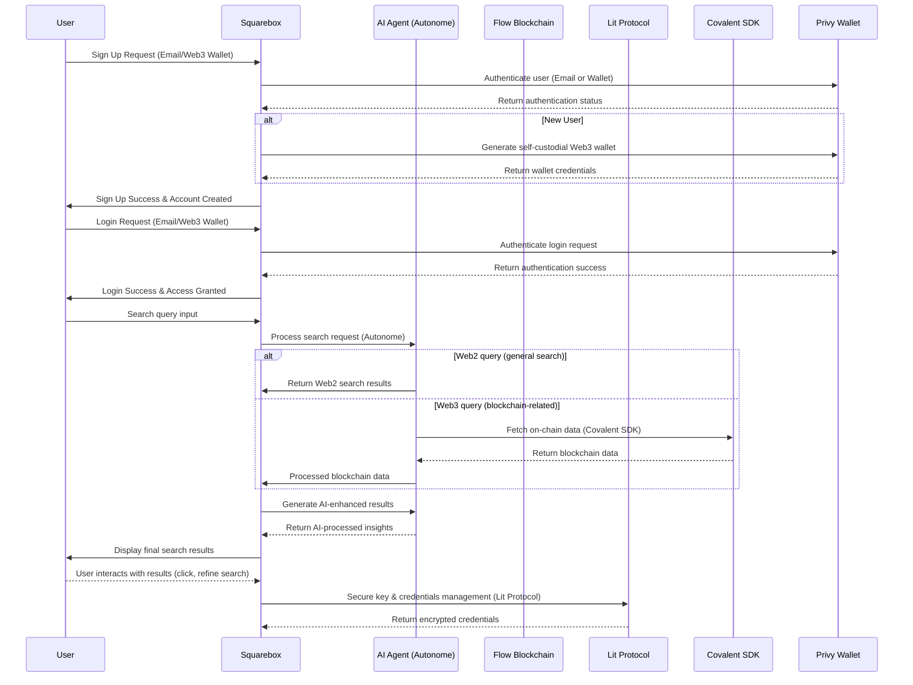

# Squarebox

[Demo]() | [Video]()

## Project Description

AI Agent Explorer is a Web3-focused search engine platform that utilizes AI agents to help users explore and analyze blockchain data, smart contracts, NFTs, and the latest Web3 trends.
The platform personalizes the search experience, processes real-time data, and offers an intuitive interface for both Web2 and Web3 users.

## Problem Statement

1. **Complexity of Web3 Data**
    - General users face difficulties in exploring blockchain data and Web3 ecosystem information.
    - Data is scattered across multiple chains, and unified search functionality is lacking.
2. **Lack of Accessibility for Beginners**
    - Complicated onboarding processes, wallet creation, and the technological gap between Web2 and Web3 deter many users.
3. **Security Issues**
    - Users are exposed to security risks while managing sensitive data.

## Solution

AI Agent Explorer provides the following solutions:

- Real-time Web3 information delivery and user-specific data exploration using AI agents.
- A user-friendly onboarding environment that integrates Web2 and Web3 seamlessly.
- Enhanced security for sensitive data through solutions like Lit Protocol.

## Key Features

1. **AI-Driven Web3 Data Search**
    - The platform allows real-time exploration and analysis of various Web3 information, such as keywords, smart contracts, and NFTs.
    - AI agents suggest search results tailored to user intent.
2. **Personalized Search Experience**
    - Offers customized search results based on user behavior data.
    - Utilizes Autonome AI agents to automatically post trending data to social media.
3. **Integrated Web2 and Web3 Onboarding**
    - Privy enables wallet creation with just email or social login, allowing users to easily access the Web3 environment.
4. **Enhanced Security and Data Management**
    - Lit Protocol ensures secure storage and management of wallet keys and sensitive data.
5. **Real-Time Data Visualization**
    - Leverages Covalent to intuitively visualize blockchain data and Web3 trends.
6. **Scalability and High-Speed Processing**
    - Utilizes Flow’s high-speed network to process large-scale data in real time.

## How Sponsors Are Utilized

1. **Autonome**
    - **Trend Analysis and Automation**: Leverages Autonome AI agents to analyze the most searched keywords and news, automatically posting them on social media platforms like Twitter.
    - **Custom Agent Creation**: Deploys search agents tailored to specific topics based on user needs.
2. **Flow**
    - **Scalable Blockchain Data Search**: Enables the exploration of smart contracts and NFT data across multiple chains using Flow’s EVM compatibility.
    - **High-Speed Processing and Scalability**: Improves real-time processing speed for the search engine.
3. **Lit Protocol**
    - **Sensitive Data Protection**: Securely manages wallet keys and passwords using Lit Protocol’s key management system.
    - **User Access Control**: Manages resources and policies that agents can access securely.
4. **Covalent**
    - **Data Visualization and Analysis**: Uses Covalent’s AI Agent SDK to help users visualize and analyze Web3 data.
    - **Context-Aware AI**: Understands user search intent and provides tailored results.
5. **Privy**
    - **Web2 User Onboarding**: Simplifies platform access for all users with Privy’s social login and email-based wallet creation features.
    - **Web3 Wallet Integration**: Provides seamless connectivity for existing wallet users.

## Flow Diagram

### How Squarebox Utilizes Sponsor Tracks

| **Sponsor Track** | **Application in Squarebox** |
| --- | --- |
| **Privy** | Handles sign-up, login, and self-custodial wallet generation for all users |
| **Autonome** | AI Agent processes search queries and enhances Web3 search results |
| **Flow** | Used for blockchain-related search functionalities |
| **Lit Protocol** | Ensures secure management of private keys and authentication data |
| **Covalent** | Retrieves on-chain blockchain data for Web3 search queries |

### Flow

1. **Sign-up & Login (Only Privy)**
    - **Privy handles authentication** (Email or Wallet-based)
    - **Generates self-custodial Web3 wallet for new users**
2. **Search Functionality**
    - **Web2 Search**: Uses Autonome AI Agent for results
    - **Web3 Search**: Fetches blockchain data via Covalent SDK
3. **Security & Data Management**
    - **Lit Protocol** protects sensitive credentials and API keys

# React + Vite

This template provides a minimal setup to get React working in Vite with HMR and some ESLint rules.

Currently, two official plugins are available:

- [@vitejs/plugin-react](https://github.com/vitejs/vite-plugin-react/blob/main/packages/plugin-react/README.md) uses [Babel](https://babeljs.io/) for Fast Refresh
- [@vitejs/plugin-react-swc](https://github.com/vitejs/vite-plugin-react-swc) uses [SWC](https://swc.rs/) for Fast Refresh
